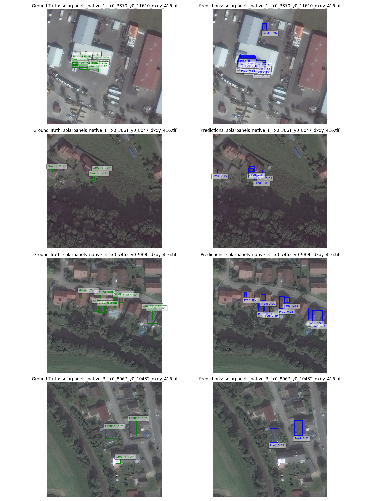

# Solar Panel Detector (SRIP Project Task)

This project aims to build a solar panel detector using the YOLOv12 model. The detector can identify and locate solar panels in high-resolution aerial images.

## 📂 Project Structure
- `Solar Panel Detector.ipynb`: Jupyter notebook for data exploration, data splitting, model training, and evaluation.
- `train.py`: Script to train the YOLOv12 model.

## 📊 Dataset:

- Images (31 cm native resolution, resized to 416x416): [Google Drive](https://drive.google.com/drive/folders/13QfMQ-7OdWKw-LR8DmypKwSHtI0Hk2wh?usp=sharing)

- Labels and README: [Google Drive](https://drive.google.com/drive/folders/13QfMQ-7OdWKw-LR8DmypKwSHtI0Hk2wh?usp=sharing)

- Label Description: [Figshare](https://figshare.com/articles/dataset/Solar_Panel_Object_Labels/22081091)

- Annotation Format: MS-COCO

- Annotation Type: Horizontal Bounding Boxes (HBB)

## 🔮 Predictions

## Author

Shardul Junagade

## License

This project is licensed under the MIT License - see the [LICENSE](LICENSE) file for details.

