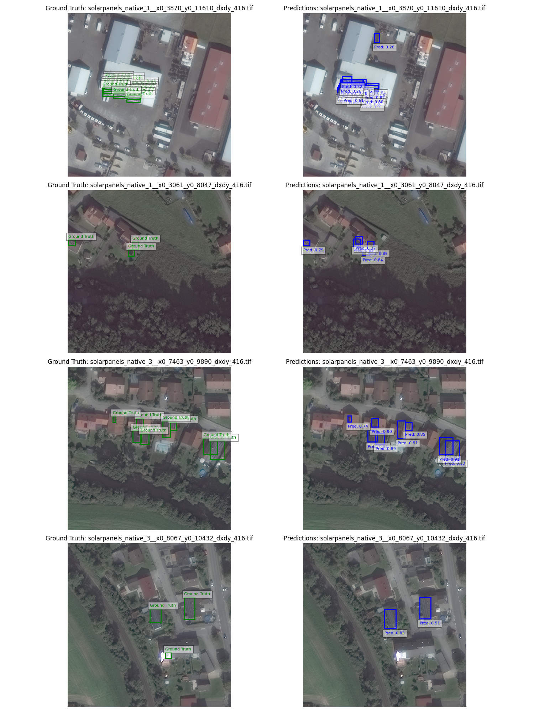

# Solar Panel Detector (SRIP Project Task)

This project aims to build a solar panel detector using the YOLOv12 model. The detector can identify and locate solar panels in high-resolution aerial images.

## 📂 Project Structure
- `Solar Panel Detector.ipynb`: Jupyter notebook for data exploration, data splitting, model training, and evaluation.
- `train.py`: Script to train the YOLOv12 model.


## 📊 Dataset:

- Images (31 cm native resolution, resized to 416x416): [Google Drive](https://drive.google.com/drive/folders/13QfMQ-7OdWKw-LR8DmypKwSHtI0Hk2wh?usp=sharing)

- Labels and README: [Google Drive](https://drive.google.com/drive/folders/13QfMQ-7OdWKw-LR8DmypKwSHtI0Hk2wh?usp=sharing)

- Label Description: [Figshare](https://figshare.com/articles/dataset/Solar_Panel_Object_Labels/22081091)

- Annotation Format: MS-COCO

- Annotation Type: Horizontal Bounding Boxes (HBB)


## 🔮 Predictions



## 🛠️ Setup:

1. Clone the repository:
   ```bash
   git clone https://github.com/your-repo/solar-panel-detector.git
   cd solar-panel-detector
   ```

2. Create a virtual environment and install dependencies:
   ```bash
   pip install uv
   uv venv
   source venv/bin/activate  # On Windows use `venv\Scripts\activate`
   uv pip install -r requirements.txt
   ```

3. Download the dataset:
   - Images (31 cm native resolution, resized to 416x416): [Google Drive](https://drive.google.com/drive/folders/13QfMQ-7OdWKw-LR8DmypKwSHtI0Hk2wh?usp=sharing)
   - Labels and README: [Google Drive](https://drive.google.com/drive/folders/13QfMQ-7OdWKwSHtI0Hk2wh?usp=sharing)

4. Split the dataset into training, validation, and test sets:
   Run the data splitting script in the Jupyter notebook to create the `split_data` directory.


## Author

Shardul Junagade


## License

This project is licensed under the MIT License - see the [LICENSE](LICENSE) file for details.


